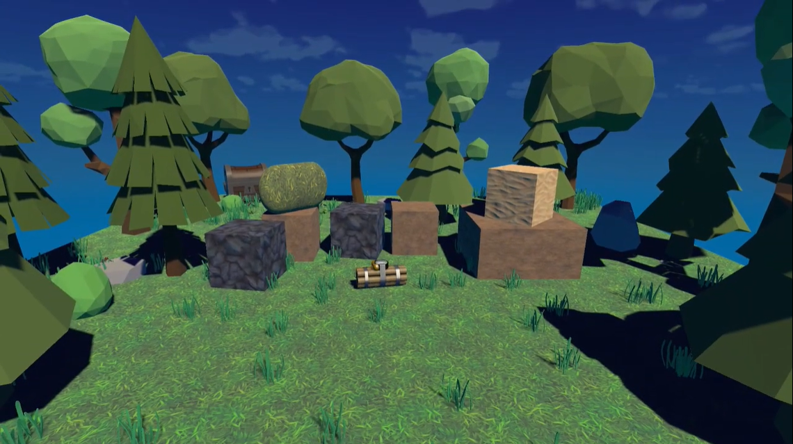

# GAME TITLE: 3D ADWENTURE ENVIRONMENT

## DESCRIPTION
The environment features an immersive 3D space where players can explore and interact with their surroundings. This dynamic environment allows for walking, jumping, and various interactions with objects.

## Demonstration video
Watch [game demo video](https://drive.google.com/file/d/1AfnGs3nRjNq8GFPfb2JHatE8PeCETUVa/view?usp=sharing) to get acquainted with the game.

## FEATURES
- **Movement**: walk and jump freely within the 3D space.
- **Turning**: rotate your character to explore the environment.
- **Bomb interaction**: click on a bomb to make it explode.
- **Treasure chest**: press "Q" to open a treasure chest and reveal its contents.
- **Restarting**: press "R" to restart the space at any time.
- **Camera control**: move the mouse to rotate the camera and look around the environment.
